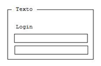
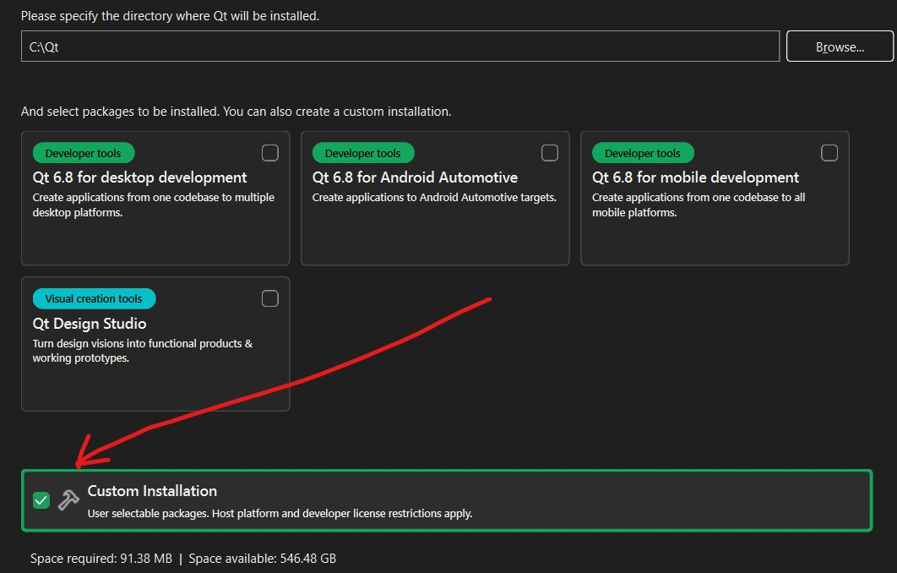
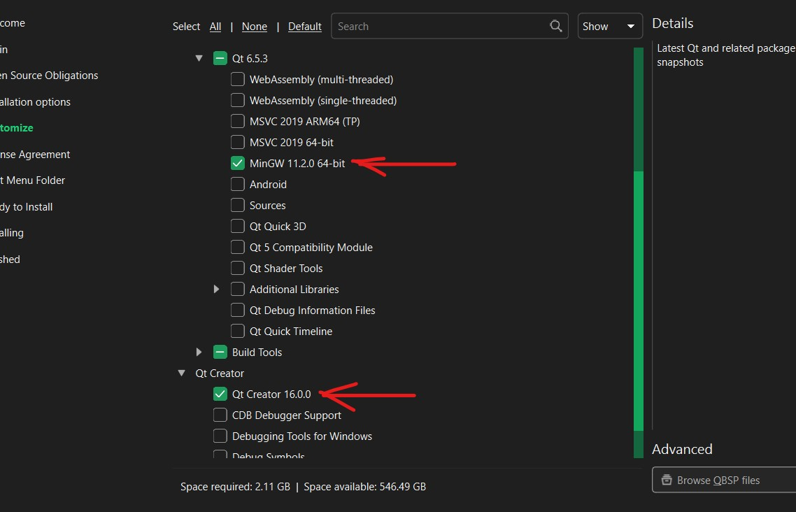

.. -*- coding: utf-8 -*-

.. _rcs_subversion:

Clase 09 - POO 2025
===================
(Fecha: 31 de marzo)

Registro en video de algunos temas de la clase de hoy
^^^^^^^^^^^^^^^^^^^^^^^^^^^^^^^^^^^^^^^^^^^^^^^^^^^^^

`Array como parámetro QTextEdit Preprocesador Guardián 2025 <https://youtu.be/RThbIuZvrJQ>`_

`Login en empty project 2025 <https://youtu.be/Gdo6NcdOuPo>`_

`Login con QtDesigner 2025 <https://youtu.be/9Z208vj-jCw>`_

`Trabajo integrador prompt con OpenAI 2025 <https://youtu.be/HssG_ACtoS4>`_

`Sutileza con punteros - octal - arrays como parámetros 2021 <https://www.youtube.com/watch?v=XQOBvBVkffM>`_

`QNetworkAccessManager y colocar imagen en login 2023 <https://youtu.be/PFSWwS-RHyI>`_

`Login con imagen generando código con el chat 2024 <https://youtu.be/vVbO58KlNO8>`_

`Array como parámetros - QTextEdit y aritmética de punteros 2023 <https://youtu.be/FzbxG3KJkdE>`_

`QGroupBox - QString number 2021 <https://www.youtube.com/watch?v=c7_axxXbphU>`_

`Preprocesador y guardían de inclusión múltiple 2023 <https://youtu.be/75RIKDem8NI>`_

Array como parámetro en funciones
^^^^^^^^^^^^^^^^^^^^^^^^^^^^^^^^^

.. code-block::

	#include <iostream>
	using namespace std;

	void funcion( int miArray[] );
	// Le estamos pasando un puntero al primer elemento del array.

	int main()  {
	    int miA[ 5 ] = { 0, 1, 2, 3, 4 };

	    funcion( miA );

	    cout << miA[ 0 ] << miA[ 1 ] << miA[ 2 ] << miA[ 3 ] << miA[ 4 ];
	}

	void funcion( int miArray[] )  {
	    miArray[ 0 ] = 5;  // Las modificaciones quedarán.

	    miArray[ 3 ] = 5; 
	} 

QTextEdit
=========

- Un QWidget que muestra texto plano o enriquecido
- Puede mostrar imágenes, listas y tablas
- La barra de desplazamiento es automática
- Interpreta tags HTML
- Seteamos texto con setPlainText()

QGroupBox
^^^^^^^^^ 

.. code-block::

	QGroupBox * grupo = new QGroupBox( "Texto" );
	QGridLayout * layout = new QGridLayout;
	
	layout->addWidget( label, 0, 0 );
	layout->addWidget( usuario, 1, 0, 1, 2 );
	layout->addWidget( clave, 2, 0, 1, 2 );
	
	grupo->setLayout( layout );

El preprocesador
^^^^^^^^^^^^^^^^

-	Analiza el archivo fuente antes de la compilación real
-	Realiza las sustituciones de macros
-	Una macro es un patrón de sustitución formado por expresiones textuales
-	Procesa las directivas (``#include``, ``#define``, ``#ifndef``, ...)
-	Elimina los comentarios.

**Directivas #ifdef #endif #ifndef**

- Con ``#ifdef`` si la macro está definida, entonces hace lo siguiente hasta encontrar un ``#endif``
- ``#ifndef`` pregunta si no está definida

**Directiva #include**

- Inserta archivos
- Influye sobre el ámbito y los identificadores

.. code-block::

	#include <nombre de fichero cabecera>
	#include "nombre de fichero de cabecera"

**Directiva #define**

- Define macros para sustituir cada vez que se encuentre el identificador.

.. code-block::

	#define identificador <secuencia>
	
-	Si 'secuencia' no existe, el identificador será eliminado cada vez que aparezca
-	No es necesario añadir un punto y coma al final
-	Termina en el primer retorno de línea encontrado

Guardián de inclusión múltiple
^^^^^^^^^^^^^^^^^^^^^^^^^^^^^^

- Este problema se soluciona con el uso del **Guardián de inclusión múltiple**:

.. code-block::

	#ifndef PRINCIPAL_H
	#define PRINCIPAL_H

	// . . . 

	#endif // PRINCIPAL_H

Ejercicio 10:
============

- Replicar el ejemplo del login en un empty project
- Grabar un video explicando el desarrollo de esta aplicación
- Subirla a Youtube como No listado
- El video referencia es: `Login en empty project 2025 <https://youtu.be/Gdo6NcdOuPo>`_

Ejercicio 11:
============

- Replicar el ejemplo del login en QtDesigner
- Grabar un video explicando el desarrollo de esta aplicación
- Subirla a Youtube como No listado
- El video referencia es: `Login con QtDesigner 2025 <https://youtu.be/9Z208vj-jCw>`_

Extras: 
======

Instalación de Biblioteca Qt, QtCretor y MinGW 
^^^^^^^^^^^^^^^^^^^^^^^^^^^^^^^^^^^^^^^^^^^^^^

- Descargar instalador desde: `https://www.qt.io/download-qt-installer-oss <https://www.qt.io/download-qt-installer-oss>`_
- Lo más común es elegir <strong>Qt Online Installer for Windows (x64)</strong>
- Comenzar a instalar y crear una nueva cuenta individual.

- Realizar una instalación personalizada

- Recordar que es una cuenta individual personal.

- Instalar únicamente Qt 6.5.3, MinGW 11.2.0 64 bits y QtCreator 16.0.0

