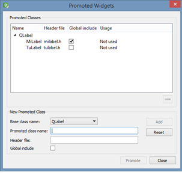

.. -*- coding: utf-8 -*-

.. _rcs_subversion:

Clase 17 - POO 2025
===================
(Fecha: 25 de abril)

Registro en video de algunos temas de la clase de hoy
=====================================================

`signals propias y promoción en QtDesigner 2025 <https://youtu.be/P4ia1YqdhX0>`_

`Gestión de ventanas con Manager 2025 <https://youtu.be/lcm6lSGWPLM>`_

`Enumeraciones 2025 <https://youtu.be/rRR-0_IgD0k>`_

`Clase Boton <https://youtu.be/ZrvRPt5u4dw>`_

`MD5 - AdminDB mostrarTabla - signals propias 2023 <https://youtu.be/ho4nMxIDDU8>`_

`Señales propias 2022 <https://youtu.be/4aSg0uv4zdw>`_ 

`Manager 2022 - https://youtu.be/smkrsoyeB68 <https://youtu.be/smkrsoyeB68>`_ 

`Incorporación de enum a Login 2024 <https://youtu.be/9gk9FXsc3mE>`_ 

`Enum - Manager - QtDesigner con clase propia - signals propias 2023 <https://youtu.be/pYFpLLU4dJM>`_ 

`Enumeraciones - https://youtu.be/pD5sbMKiGSM <https://youtu.be/pD5sbMKiGSM>`_ 

Señales propias
^^^^^^^^^^^^^^^

- Si necesitamos enviar una señal se utiliza la palabra reservada ``emit``.

.. code-block:: c	

	int i = 5;
	emit signal_enviarEntero( i );

- La función ``signal_enviarEntero( int a )`` debe estar declarada con el modificador de acceso ``signals``

.. code-block:: c	

	signals:
	    void signal_enviarEntero( int );

- No olvidarse de la macro ``Q_OBJECT`` para permitir a esta clase usar signals y slots.
- Las signals deben ser compatibles en sus parámetros con los slots a los cuales se conecten.
- Solamente se declara esta función (Qt se encarga de definirla).

Uso de una clase propia con QtDesigner
======================================

- Deben heredar de algún QWidget
- Colocamos el widget (clase base) con QtDesigner
- Clic derecho "Promote to"

					 
- Base class name: QLabel
- Promoted class name: MiLabel
- Header file: miLabel.h
- Add (y con esto queda disponible para promover)
- La clase MiLabel deberá heredar de QLabel
- El constructor debe tener como parámetro:

.. code-block::

	MiLabel( QWidget * parent = 0 );  // Esto en miLabel.h

	MiLabel::MiLabel( QWidget * parent ) : QLabel( parent )  {  // Esto en miLabel.cpp
	
	}

Clase Manager
=============

- Encargada de administrar las conexiones principales y la visualización de todas las ventanas de la aplicación

Enumeraciones
=============

- Es un tipo especial de variable
- Sus valores son constantes enteras
- Estos valores pueden ser autogenerados (0, 1, 2, 3, ...)

.. code-block:: c	

	enum los_dias { DOM, LUN, MAR, MIE, JUE, VIE, SAB } dia;

	enum los_dias { DOM = 7, LUN = 1, MAR, MIE, JUE = 0, VIE, SAB };

- Las variables de este tipo pueden adoptar sólo valores DOM, LUN, ...
- Es decir, la variable "dia" puede tomar DOM o LUN o MAR ...
- Las enumeraciones declaradas dentro de una clase tiene la visibilidad de la clase

.. code-block:: c	

	class Dia  {
	public:
	    enum los_dias { LUN, MAR, MIE, JUE, VIE };
	    int un_dia;
	};

	int main( int argc, char ** argv )  {
	    Dia d1;
	    d1.un_dia = Dia::LUN;
	}

**Ejemplo**

.. code-block:: c	

	// figura.h
	class Figura : public QWidget  {
	    Q_OBJECT

	public:
	    enum Forma { CIRCULO, CUADRADO };

	    Figura( QWidget * parent = 0 );

	    void dibujar( Forma forma );

	protected:
	    void paintEvent( QPaintEvent * );

	private:
	    Forma forma;
	};

	// figura.cpp
	Figura::Figura( QWidget * parent ) : QWidget( parent ), forma( CIRCULO )  {  }

	void Figura::dibujar( Forma forma )  {
	    this->forma = forma;
	    this->repaint();
	}

	void Figura::paintEvent( QPaintEvent * )  {
	    QPainter pincel( this );
	    
	    switch( forma )  {
	    case CIRCULO:
	        // dibujar circulo
	        break;

	    case CUADRADO:
	        // dibujar cuadrado
	        break;

	    default:;
	    }
	}

	// main.cpp
	int main( int argc, char ** argv )  {
	    QApplication a( argc, argv );

	    Figura figura;
	    figura.dibujar( Figura::CUADRADO );
	    figura.show();

	    return a.exec();
	}

Ejercicio 17:
=============
 
- Crear un proyecto Qt Widget Application con un QWidget que sea la clase Ventana
- Crear una clase Boton que hereda de QWidget
- Redefinir paintEvent en Boton y usar fillRect para dibujarlo de algún color
- Definir el siguiente método en Boton:

.. code-block:: c

	Boton * boton = new Boton;
	boton->colorear( Boton::Azul );

	// Este método recibe como parámetro una enumeración que puede ser:
	// Boton::Azul  Boton::Verde  Boton::Magenta

- Usar QtDesigner para Ventana y Boton. Es decir, Designer Form Class
- Definir la enumeración en Boton
- Abrir el designer de Ventana y agregar 5 botones (objetos de la clase Boton). Promocionarlos
- Que esta Ventana con botones quede lo más parecido a la siguiente imagen:

.. figure:: imagenes/botones.png

- Usar para Ventana grid layout, usar espaciadores y usar todos los recursos posibles del QtDesigner
- Dibujar un fondo agradable con paintEvent y drawImage
- Que Boton tenga la señal signal_clic()

